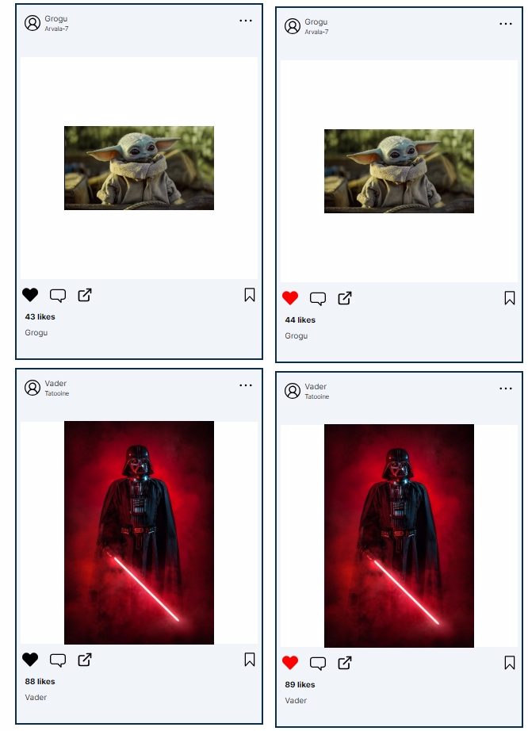

<h1> Atividade 3

<h3> Exercicio sobre Renderização condicional  <h3>

<h4> Principais Caracteristicas:

 1. Foi realizado a criação de 4 componentes: 1 para a parte superior do card, 1 da imagem e 1 da parte inferior, todos estes componentes foram colocados em um componente principal.

2. Em todos os componentes está sendo utilizado propriedades específicas a serem passadas

3. Foi utilizado o evento de click e o useState para renderizar condicionalmente o botão de like para mudar de cor

4. Com a utilização do hook 'useState' é possivel mudar a quantidade de likes ao clicar no botão, e possível diminuir o like tbm

